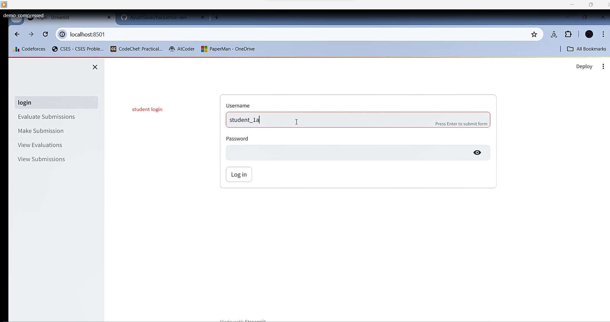
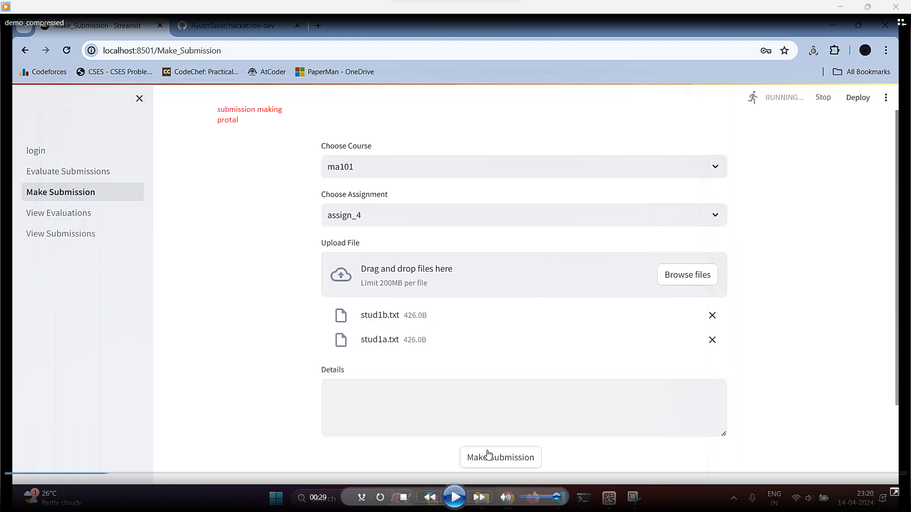
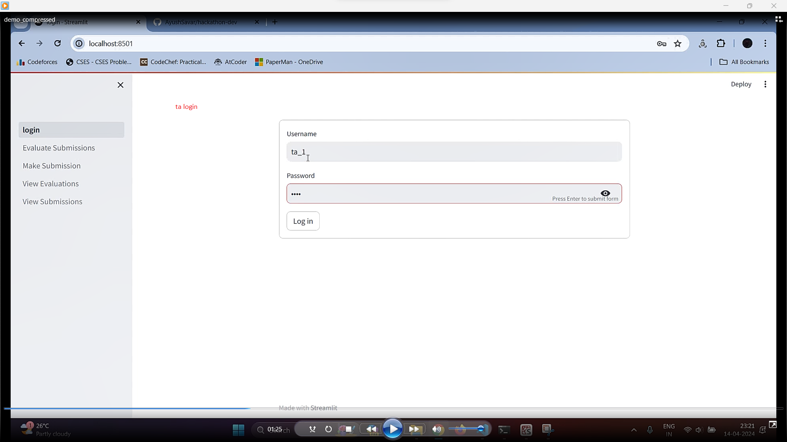
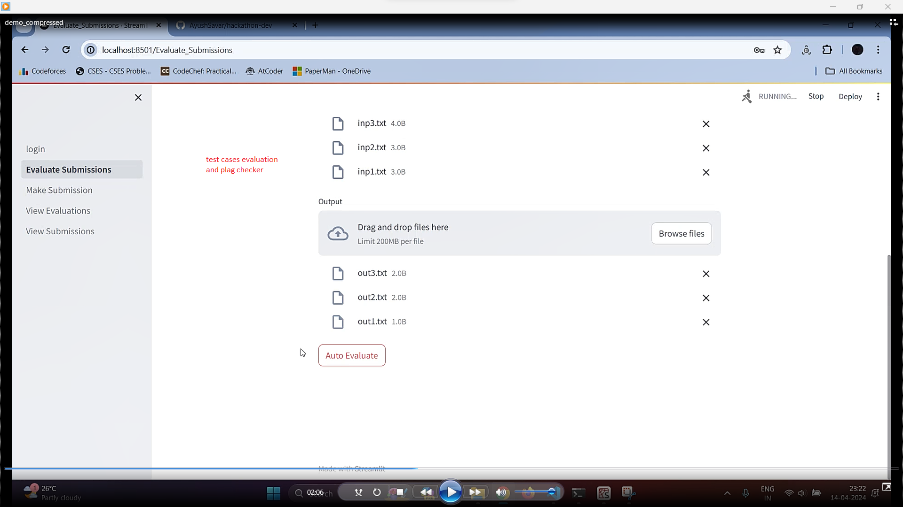
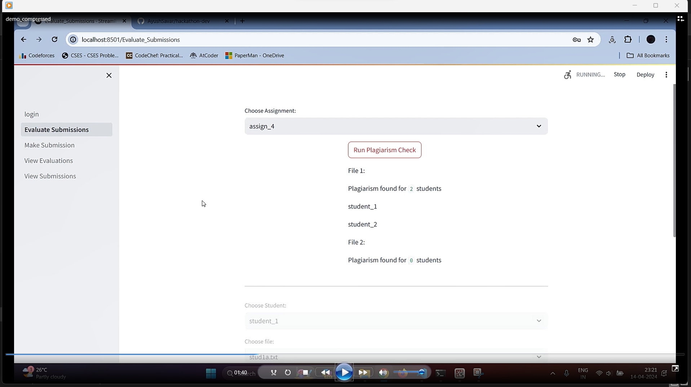
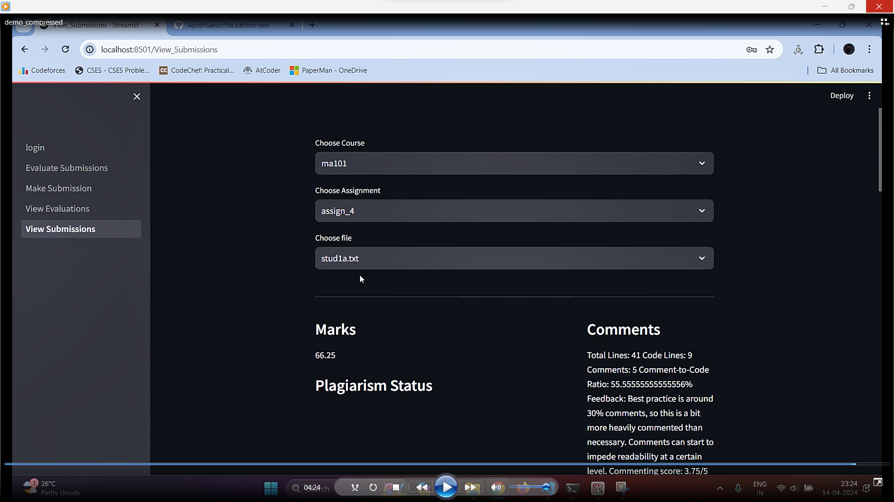
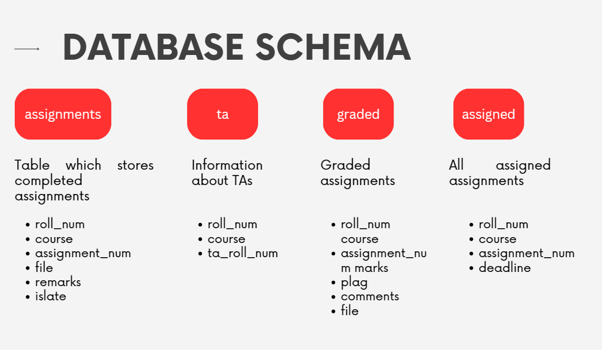

# Assignment Auto Grader Portal

Assignment submission and grading portal with both student and evaluator interfaces for simplifying and automating assignment submission and grading.  

# Features

1. Authentication : 

2. Uploading of files : Students can securely sign in and submit multiple files for all their assignments through the portal, streamlining the submission process and ensuring convenience and confidentiality.

3. Provision of late submission : The portal tracks and verifies submission times, distinguishing between submissions made before or after the assignment's specified deadline, aiding in enforcing timely submission policies.

4. Plagiarism detection : The evaluator can utilize the built-in plagiarism checker to compare each submitted file with those of other students, returning true if the similarity exceeds a predefined threshold, ensuring academic integrity and originality.
The plague checker calculates the cosine similarity score based on their TF-IDF representations.

5. Auto-grading : The evaluator is equipped to test submitted code against provided input files, comparing the output generated by the code with the corresponding expected output files, facilitating automated testing and validation of the code's functionality. The portal also prints syntax errors to assist evaluators in identifying and understanding any code issues, ensuring comprehensive assessment and feedback. 

6. Review and Feedback : The portal evaluates code quality using diverse metrics, assigning scores based on performance in each metric. It then computes a total score for the submission, comprising points for test case success (out of 75) and code/documentation quality (out of 25), providing a comprehensive assessment of the submission's overall quality and functionality.

# Future Updates

1. Support for Additional Programming Languages: Expand support for a wider range of programming languages, accommodating diverse curriculum requirements and student preferences.
2. Mobile Application: Develop a mobile application version of the portal, providing students with convenient access to assignment submission, grading feedback, and course materials on their smartphones or tablets.

# Known Errors
1. After logging in, if the user goes back to the login page, the session state no longer exists hence an error pops up. To circumvent this reload the page. This does not affect the working of the portal. 
2. Plagiarism and late submission are implemented correctly in the backend but code to display these could not be completed.

### Installing the dependencies
**Make sure that you have `Python 3.10` installed in your system**

Run the following command in the terminal
```
pip install -r requirements.txt
```

### Running the program
Now, to run the script enter the following command in the terminal
```bash
streamlit run login.py
```

# Screenshots








##
Link to demonstration : https://drive.google.com/drive/folders/1z3c3kWJSa13Wfinx4feV6KJnXSL8H8e3?usp=sharing 

Made by : 
1. Arush Shaleen Mathur(220101017)
2. Ayush Kumar(220101021)
3. Ayush Savar(220101022)
